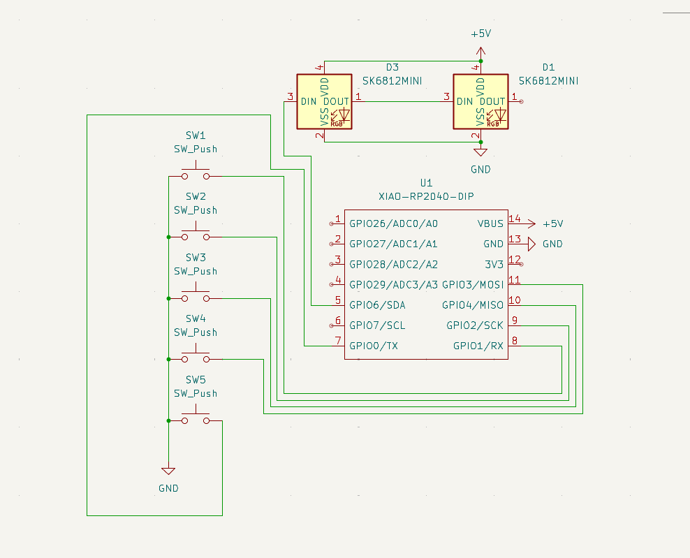

# Peleg's Hackpad

My HACKPAD version, it contains 5 button:
SW1 - toggle deafen (discord) - 1
SW 2 - toggle mute (discord) - 2
SW 3 - Stop / Start music - 4
SW 4 - next song - 3
SW 5 - Windows + l (sleep) - 0

My Schematic:

The PCB:

List of materials:
LED_SMD *2
SW_push * 5
XIAO-RP2040-DIP * 1
